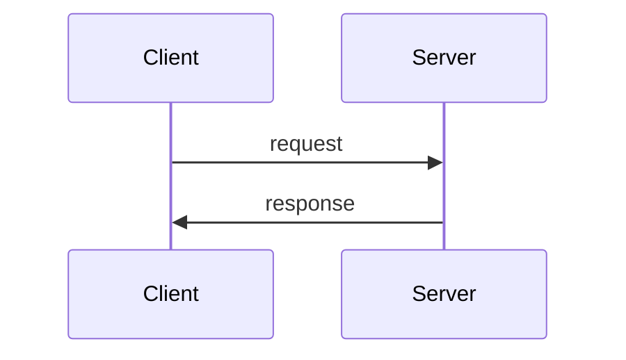
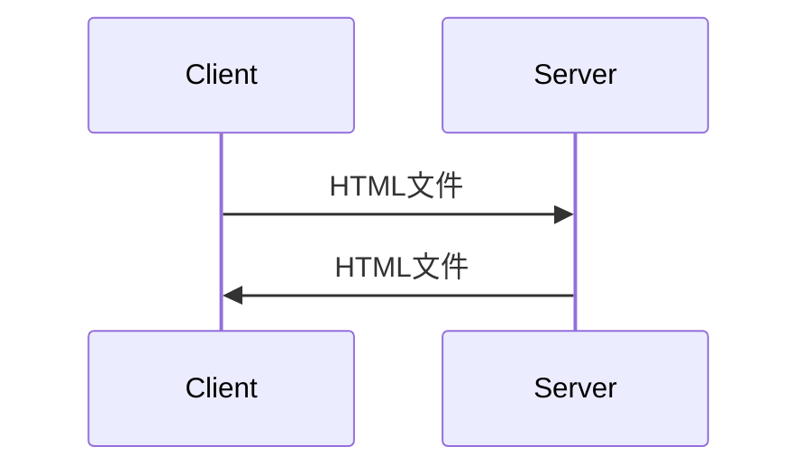
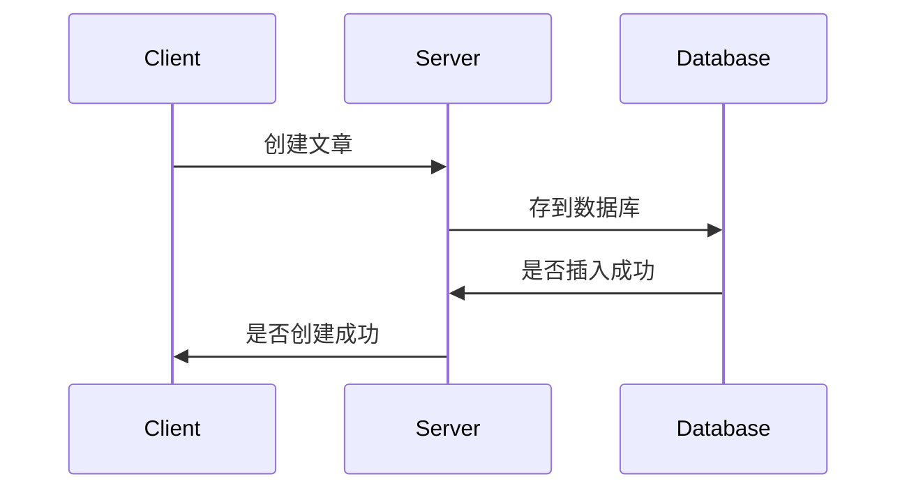
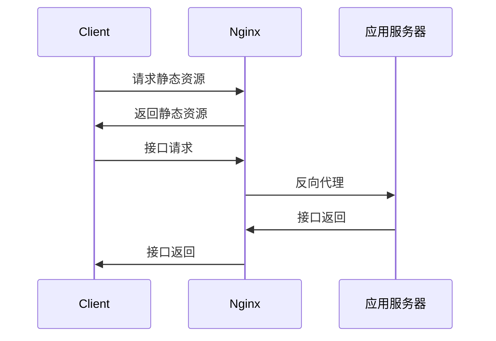

---
# try also 'default' to start simple
theme: seriph
# random image from a curated Unsplash collection by Anthony
# like them? see https://unsplash.com/collections/94734566/slidev
background: https://source.unsplash.com/collection/94734566/1920x1080
# apply any windi css classes to the current slide
class: 'text-center'
# https://sli.dev/custom/highlighters.html
highlighter: shiki
# show line numbers in code blocks
lineNumbers: false
# some information about the slides, markdown enabled
info: |
  ## Slidev Starter Template
  Presentation slides for developers.

  Learn more at [Sli.dev](https://sli.dev)
# persist drawings in exports and build
drawings:
  persist: false
---

# Web前端简史

汇报人： 窦一鸣


<div class="abs-br m-6 flex gap-2">
  <button @click="$slidev.nav.openInEditor()" title="Open in Editor" class="text-xl icon-btn opacity-50 !border-none !hover:text-white">
    <carbon:edit />
  </button>
  <a href="https://github.com/slidevjs/slidev" target="_blank" alt="GitHub"
    class="text-xl icon-btn opacity-50 !border-none !hover:text-white">
    <carbon-logo-github />
  </a>
</div>

<!--
The last comment block of each slide will be treated as slide notes. It will be visible and editable in Presenter Mode along with the slide. [Read more in the docs](https://sli.dev/guide/syntax.html#notes)
-->

---

# 基本模式

C/S架构，客户端发送请求，服务器响应请求

<div grid="~ cols-2 gap-4">

<div class="flex items-center">

- 使用HTTP协议通信
- 通信过程是异步的
- 数据存储在服务器
- 客户端负责展示数据和响应用户交互

</div>
  

  
</div>

---

# 静态内容

服务器发送静态HTML，用户只能请求和查看
<div grid="~ cols-2 gap-4">

<div class="flex items-center">

- 每个URL对应一个单独的页面
- 用户和服务器不存在交互
- 新闻类网站

</div>
  

  
</div>

---

# 动态内容

服务器发送动态生成的HTML
<div grid="~ cols-2 gap-4">

<div>

- PHP语言的出现
- 用户可以创建内容，保存在服务器
- 博客类网站

```php {all|1-3|9|12|11|all}
<%@ page language="java" contentType="text/html; charset=UTF-8"
    pageEncoding="UTF-8"%>
<%@ page import="java.io.*,java.util.*" %>
<!DOCTYPE html>
<html>
  <body>
    <h1>编辑博客</h1>
    <p>用户名：
       <%= User.getName()%>
    </p>
    <form action="main.jsp" method="POST">
      内容: <input type="text" name="content">
      <br />
      <input type="submit" value="提交" />
    </form>
  </body>
</html>
```

</div>

  

  
</div>

---

# 前后端分离

前端和后端分开为两个单独的工程，前端负责处理页面展示和用户交互，后端负责数据处理

<div grid="~ cols-2 gap-4">

<div class="mt-50px">

- 关注点分离，代码解耦
- ajax技术的出现，动态请求数据，而不需要重载页面
- 服务器分为静态资源服务器和Web应用服务器

</div>
  

  
</div>


---

# jQuery

jQuery 是一个 JavaScript 库, 极大地简化了 JavaScript 编程

<div grid="~ cols-2 gap-4" >

<div class="mt-50px">

- 简化DOM操作
- 封装Ajax请求
- 兼容多种浏览器
- 动画、jQueryUI等。

</div>

<div style="height: 400px; overflow: scroll">

```js {all|3-7|9-10|12-24|26-29|all}
// 添加元素

// 原生js
let ol = document.getElementsByTagName('ol')
let newLi = document.createElement('li')
newLi.innerHTML = '追加列表项'
ol.appendChild(newLi)

// jQuery实现
$("ol").append("<li>追加列表项</li>");

//Ajax请求

// 原生js
let xhr = new XMLHttpRequest();
xhr.open('GET', 'http://example.com/api');
xhr.send();
xhr.onreadystatechange = function(){
　　if ( xhr.readyState == 4 && xhr.status == 200 ) {
　　　　console.log( xhr.responseText );
　　} else {
　　　　console.log( xhr.statusText );
　　}
};

// jQuery实现
$.ajax({url:"http://example.com/api",success:function(result){
    $("#div1").html(result);
}});

```
</div>
  
</div>


---

# Vue

Vue是一套用于构建用户界面的渐进式框架。

<div grid="~ cols-2 gap-4" >


<div class="mt-50px">

- 声明式渲染
- 条件与循环
- 组件化应用构建
- Vue生态

</div>

<div style="height: 400px; overflow: scroll">

```js

// html
<span class="hello" id="hello" key="1"></span>

// vdom
{
  tag: "span",
  data: {
    staticClass: "hello"
    id: "hello"
    key: "1",
  }
}

```

</div>

</div>
  
---

# 前端工程化

基于Node的前端从开发到部署的全流程的效能提升。

<div grid="~ cols-2 gap-4">

<div>

- 开发
  - 新语法编译
  - 代码风格校验/格式化
  - 构建打包
- 调试
  - dev server
  - HMR
  - SourceMap

</div>

<div>

- 测试
  - 单元测试
  - e2e测试
- 提交
  - 提交前代码风格校验
  - 通过测试
- 部署
  - CI/CD

</div>

</div>

