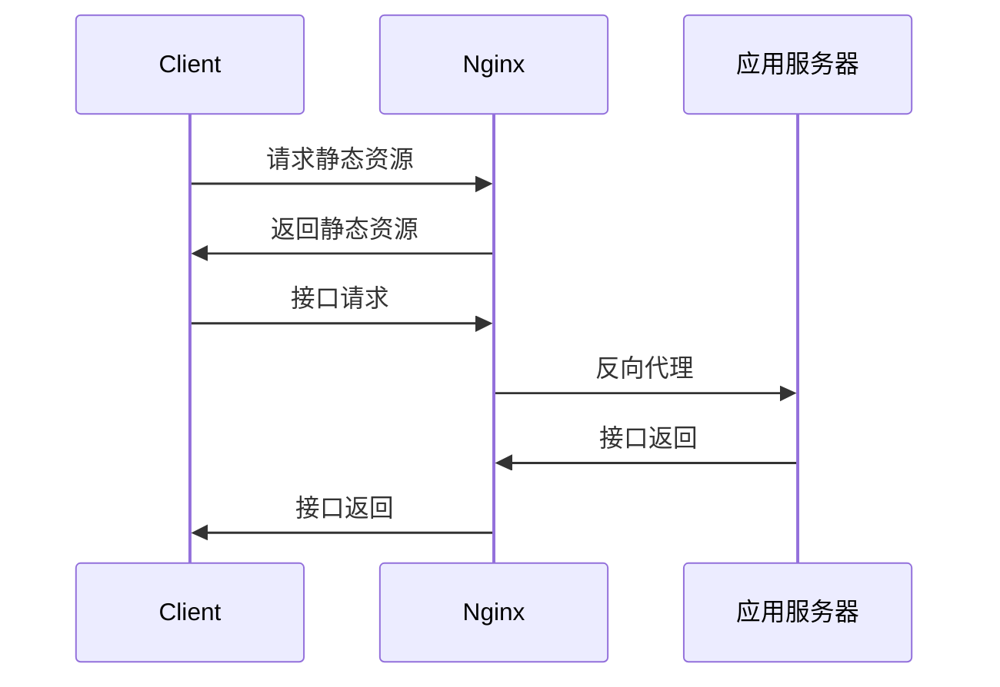

---
# try also 'default' to start simple
theme: seriph
# random image from a curated Unsplash collection by Anthony
# like them? see https://unsplash.com/collections/94734566/slidev
background: https://source.unsplash.com/collection/94734566/1920x1080
# apply any windi css classes to the current slide
class: 'text-center'
# https://sli.dev/custom/highlighters.html
highlighter: shiki
# show line numbers in code blocks
lineNumbers: false
# some information about the slides, markdown enabled
info: |
  ## Slidev Starter Template
  Presentation slides for developers.

  Learn more at [Sli.dev](https://sli.dev)
# persist drawings in exports and build
drawings:
  persist: false
---

# 前端安全简介

汇报人： 窦一鸣

<div class="abs-br m-6 flex gap-2">
  <button @click="$slidev.nav.openInEditor()" title="Open in Editor" class="text-xl icon-btn opacity-50 !border-none !hover:text-white">
    <carbon:edit />
  </button>
  <a href="https://github.com/slidevjs/slidev" target="_blank" alt="GitHub"
    class="text-xl icon-btn opacity-50 !border-none !hover:text-white">
    <carbon-logo-github />
  </a>
</div>

<!--
The last comment block of each slide will be treated as slide notes. It will be visible and editable in Presenter Mode along with the slide. [Read more in the docs](https://sli.dev/guide/syntax.html#notes)
-->

---

# XSS(Cross Site Scripting)跨站脚本攻击

存在XSS漏洞的网站允许攻击者在web页面中注入可执行代码。最开始专指的是JavaScript代码的注入，后来扩展到sql脚本和其他开发语言。

<div class="mt-8">

- 反射型，用户输入的信息直接被客户端解析并展示出来。
- 持久型，数据被存储在服务器端在其他用户访问页面时展示出来。

</div>

---

# XSS防御

<div class="mt-8">

- 用户输入转义
- 设置cookie为HttpOnly
- 请求前再次验证
- 使用CSP(Content Security Policy)

</div>

---

# 同源策略（Same-origin policy）

同源指的是协议、域名、端口号都相同

<div class="mt-8">

- 跨源写操作（Cross-origin writes）一般是被允许的。例如链接，重定向以及表单提交。特定少数的 HTTP 请求需要添加预检请求。
- 跨源资源嵌入（Cross-origin embedding）一般是被允许。
- 跨源读操作（Cross-origin reads）一般是不被允许的。
- 访问存储在浏览器中的数据,是以源进行分割。每个源都拥有自己单独的存储空间，一个源中的 JavaScript 脚本不能对属于其它源的数据进行读写操作。
- ajax请求需遵守同源策略

</div>

---

# CORS(Cross-Origin Resource Sharing)跨源资源共享

一种基于 HTTP 头的机制，该机制通过允许服务器标示除了它自己以外的其它 origin（域，协议和端口)

<div class="mt-8">

简单请求

1. 使用下列方法之一：
    - GET
    - HEAD
    - POST

2. 请求头仅包含以下字段： `Accept`, `Accept-Language`, `Content-Language`, `Content-Type`，其中Content-Type 的值仅限于下列三者之一:
    - text/plain  
    - multipart/form-data  
    - application/x-www-form-urlencoded

</div>
  
---

# CSRF(Cross Site Request Forgery)跨站请求伪造

通过cookie保存用户登状态的网站。只要cookie没有失效，发送请求时就会自动的携带对应网站的cookie。
<div class="mt-8">

特点

- 攻击发生在第三方网站
- 攻击者冒充受害者提交操作，而不是直接窃取数据
- 可以通过链接、img标签src、form表单提交等多种方式触发

防御措施

- CSRF token
- SameSite cookies

</div>
  
---

# SameSite cookies

<div class="mt-8">

The cookie-sending behavior if SameSite is not specified is SameSite=Lax. Previously the default was that cookies were sent for all requests.
  
Lax: Cookies are not sent on normal cross-site subrequests (for example to load images or frames into a third party site), but are sent when a user is navigating to the origin site

Lax replaced None as the default value in order to ensure that users have reasonably robust defense against some classes of cross-site request forgery (CSRF) attacks.

[Learn More](https://developer.mozilla.org/en-US/docs/Web/HTTP/Headers/Set-Cookie/SameSite)
</div>

---

# 前后端分离

前端和后端分开为两个单独的工程，前端负责处理页面展示和用户交互，后端负责数据处理

<div grid="~ cols-2 gap-4">

<div class="mt-50px">

- 关注点分离，代码解耦
- ajax技术的出现，动态请求数据，而不需要重载页面
- 服务器分为静态资源服务器和Web应用服务器

</div>
  

  
</div>

---

# jQuery

jQuery 是一个 JavaScript 库, 极大地简化了 JavaScript 编程

<div grid="~ cols-2 gap-4" >

<div class="mt-50px">

- 简化DOM操作
- 封装Ajax请求
- 兼容多种浏览器
- 动画、jQueryUI等。

</div>

<div style="height: 400px; overflow: scroll">

```js {all|3-7|9-10|12-24|26-29|all}
// 添加元素

// 原生js
let ol = document.getElementsByTagName('ol')
let newLi = document.createElement('li')
newLi.innerHTML = '追加列表项'
ol.appendChild(newLi)

// jQuery实现
$("ol").append("<li>追加列表项</li>");

//Ajax请求

// 原生js
let xhr = new XMLHttpRequest();
xhr.open('GET', 'http://example.com/api');
xhr.send();
xhr.onreadystatechange = function(){
　　if ( xhr.readyState == 4 && xhr.status == 200 ) {
　　　　console.log( xhr.responseText );
　　} else {
　　　　console.log( xhr.statusText );
　　}
};

// jQuery实现
$.ajax({url:"http://example.com/api",success:function(result){
    $("#div1").html(result);
}});

```

</div>
  
</div>

---

# Vue

Vue是一套用于构建用户界面的渐进式框架。

<div grid="~ cols-2 gap-4" >

<div class="mt-50px">

- 声明式渲染
- 条件与循环
- 组件化应用构建
- Vue生态

</div>

<div style="height: 400px; overflow: scroll">

```js

// html
<span class="hello" id="hello" key="1"></span>

// vdom
{
  tag: "span",
  data: {
    staticClass: "hello"
    id: "hello"
    key: "1",
  }
}

```

</div>

</div>
  
---

# 前端工程化

基于Node的前端从开发到部署的全流程的效能提升。

<div grid="~ cols-2 gap-4">

<div>

- 开发
  - 新语法编译
  - 代码风格校验/格式化
  - 构建打包
- 调试
  - dev server
  - HMR
  - SourceMap

</div>

<div>

- 测试
  - 单元测试
  - e2e测试
- 提交
  - 提交前代码风格校验
  - 通过测试
- 部署
  - CI/CD

</div>

</div>
